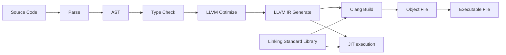

<div align="center">

# Swua 프로그래밍 언어

### LLVM을 백엔드로 사용하는 작고 하찮은 프로그래밍 언어 😃

[English](./README.md) | **한국어** | [예제](./examples) | [라이선스](./LICENSE)

</div>

# 목차

-   [개요](#개요)
-   [사용법](#사용법)
-   [문법](#문법)
-   [표준 라이브러리](#표준-라이브러리)
-   [기능 및 TODO](#기능-및-todo)

# 개요

Swua 프로그래밍 언어는 LLVM을 백엔드로 사용하는 쉽고 간단한 프로그래밍 언어입니다.
[MIT 라이선스](./LICENSE)를 따릅니다.

Swua 프로그래밍 언어는 아직 완성된 프로그래밍 언어가 아닙니다! 아직 개발 중이며, 구현되지 않은 기능이나 버그가 있을 수 있습니다.



# 사용법

빌드된 바이러니는 아직 제공하지 않습니다. 직접 빌드해서 사용해주세요.

## 직접 빌드하기

먼저 [Rust](https://www.rust-lang.org/tools/install)와 LLVM(>= 16.0)을 설치해야 합니다.

설치 후, git을 이용해 소스 코드를 받아옵니다.

```bash
$ git clone https://github.com/ky0422/swua.git
```

그리고 빌드합니다. (릴리즈 빌드를 권장합니다.)

```bash
$ cargo build --release
```

빌드가 완료되면, `target/release/swua[.exe]`가 생성됩니다. 이 실행 파일로 Swua 프로그램을 실행할 수 있으며, `cargo run` 명령어로도 실행할 수 있습니다.
이해를 돕기위해 아래에선 `swua`로 표기하겠습니다.

```bash
$ swua --help

Usage: swua [OPTIONS] <COMMAND>

Commands:
  run    JIT compile and run Swua source code
  build  Compile Swua source code to native code
  help   Print this message or the help of the given subcommand(s)

Options:
  -o, --optimization-level <OPTIMIZATION_LEVEL>  Optimization level (0-3, default: 0)
  -n, --name <NAME>                              Binary name (default: main)
      --no-verbose                               Don't print verbose information
  -h, --help                                     Print help
  -V, --version                                  Print version
```

`swua` 명령어는 `run`과 `build` 서브커맨드를 가지고 있습니다. `run`은 소스 코드를 JIT 컴파일하여 실행하고, `build`는 소스 코드를 네이티브 코드로 컴파일합니다.

-   `run`
    -   `-i`, `--input` : Swua 소스 코드 파일을 지정합니다.
-   `build`
    -   `-i`, `--input` : Swua 소스 코드 파일을 지정합니다.
    -   `-o`, `--output-dir` : 빌드 결과물을 저장할 디렉토리를 지정합니다. (기본값: `./build`)
    -   `-l`, `--llvm_ir` : LLVM IR 파일을 생성합니다.
    -   `-a`, `--asm` : 어셈블리 파일을 생성합니다.
    -   `-L`, `--link` : 외부 라이브러리를 링크합니다.
-   `--optimization-level` : 최적화 레벨을 지정합니다. (0-3, 기본값: 0)
-   `-n`, `--name` : 바이러니의 이름을 지정합니다. (기본값: `main`)
-   `--no-verbose` : 자세한 정보를 출력하지 않습니다.

# 문법

# 표준 라이브러리

# 기능 및 TODO

-   LLVM 버전: 16.0.0

-   [x] Frontend
    -   [x] Lexer
    -   [x] Parser
    -   [x] AST
    -   [x] Type Checker (Semantic Analysis)
    -   [ ] Macro
-   [x] Backend (WIP)
    -   [ ] Optimizer
    -   [x] LLVM IR Generator
-   [ ] Standard Library (WIP)
-   [ ] Documentation (WIP)
-   [ ] More examples
-   [ ] More tests

이름인 Swua에 대해 딱히 사연이 있거나 하진 않습니다. 그냥 떠오른 이름들 후보 중 하나였는데, 그냥 썼습니다.
