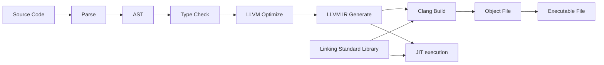

<div align="center">

# Swua 프로그래밍 언어

### LLVM을 백엔드로 사용하는 작고 하찮은 프로그래밍 언어 😃

[English](./README.md) | **한국어** | [예제](./examples) | [라이선스](./LICENSE)

</div>

# 목차

-   [개요](#개요)
-   [빌드와 사용법](#빌드와-사용법)
-   [튜토리얼](#튜토리얼)
-   [표준 라이브러리](#표준-라이브러리)
-   [기능 및 TODO](#기능-및-todo)

# 개요

Swua 프로그래밍 언어는 LLVM을 백엔드로 사용하는 쉽고 간단한 프로그래밍 언어입니다.
[MIT 라이선스](./LICENSE)를 따릅니다.

Swua 프로그래밍 언어는 아직 완성된 프로그래밍 언어가 아닙니다! 아직 개발 중이며, 구현되지 않은 기능이나 버그가 있을 수 있습니다.



# 빌드와 사용법

빌드된 바이러니는 아직 제공하지 않습니다. 직접 빌드해서 사용해주세요.

## 직접 빌드하기

먼저 [Rust](https://www.rust-lang.org/tools/install)와 LLVM(>= 16.0)을 설치해야 합니다. 설치 후, git을 이용해 소스 코드를 받아옵니다.

```bash
$ git clone https://github.com/ky0422/swua.git

# 그리고 빌드합니다.
$ cargo build --release
```

빌드가 완료되면, `target/release/swua[.exe]`가 생성됩니다. 이 실행 파일로 Swua 프로그램을 실행할 수 있으며, `cargo run` 명령어로도 실행할 수 있습니다.
이해를 돕기위해 아래에선 `swua`로 표기하겠습니다.

## 사용법

```bash
$ swua --help

Usage: swua [OPTIONS] <COMMAND>

Commands:
  run    JIT compile and run Swua source code
  build  Compile Swua source code to native code
  help   Print this message or the help of the given subcommand(s)

Options:
  -o, --optimization-level <OPTIMIZATION_LEVEL>  Optimization level (0-3, default: 0)
  -n, --name <NAME>                              Binary name (default: main)
      --no-verbose                               Don't print verbose information
  -h, --help                                     Print help
  -V, --version                                  Print version
```

`swua` 명령어는 `run`과 `build` 서브커맨드를 가지고 있습니다. `run`은 소스 코드를 JIT 컴파일하여 실행하고, `build`는 소스 코드를 네이티브 코드로 컴파일합니다.

-   `run`
    -   `-i`, `--input` : Swua 소스 코드 파일을 지정합니다.
-   `build`
    -   `-i`, `--input` : Swua 소스 코드 파일을 지정합니다.
    -   `-o`, `--output-dir` : 빌드 결과물을 저장할 디렉토리를 지정합니다. (기본값: `./build`)
    -   `-l`, `--llvm_ir` : LLVM IR 파일을 생성합니다.
    -   `-a`, `--asm` : 어셈블리 파일을 생성합니다.
    -   `-L`, `--link` : 외부 라이브러리를 링크합니다.
-   `--optimization-level` : 최적화 레벨을 지정합니다. (0-3, 기본값: 0)
-   `-n`, `--name` : 바이러니의 이름을 지정합니다. (기본값: `main`)
-   `--no-verbose` : 자세한 정보를 출력하지 않습니다.

# 튜토리얼

## 첫 프로그램 작성하고 실행하기

좋습니다! 그럼 이제 첫 Swua 프로그램을 작성하고 실행해봅시다.
`hello_world.swua`라는 이름의 파일을 생성하고, 아래의 코드를 입력해봅시다.

```rust
extern print_str as print(str) -> int
extern concat_str(str, str) -> str

define main -> int =
    print(concat_str("Hello, ", "World!"))
    return 0
```

그리고 아래의 명령어를 통해 빌드하고 실행해봅시다.

```bash
$ swua build -i hello_world.swua
$ ./build/main[.exe]
```

정말 간단합니다. 이제 생성된 바이너리를 실행해보면 `Hello, World!`가 출력될 것입니다.

이제 아래의 튜토리얼을 통하여 Swua 프로그래밍 언어에 대해 알아봅시다.

> [!NOTE]
>
> 아래의 예제부턴 이해를 돕기 위해 `define main -> int =`는 기본적으로 생략하며, 실제 코드에선 생략하지 않습니다.
> 
> 또한 확장명은 `.swua`로 통일합니다.

## 들여쓰기

Swua 프로그래밍 언어는 파이썬처럼 들여쓰기에 의해 블록을 구분하는 [Off-side 규칙](https://en.wikipedia.org/wiki/Off-side_rule)을 따릅니다.
때문에 들여쓰기에 민감하게 반응하며, 일반적으로 스페이스 4칸을 하나의 들여쓰기로 인식합니다.

구조체 리터럴과 같이 중괄호를 사용하는 경우, 들여쓰기에 영향을 받지 않습니다:

```rust
let person = Person {
    name: "John",
    age: 20,
    hobbies: ["Programming", "Basketball"]
}
```

## 세미콜론

세미콜론은 필수는 아니지만, 여러 줄에 걸쳐 작성할 때 필요합니다:

```rust
let a = 1; let b = 2; let c = 3
```

세미콜론은 특정 구문의 끝에서만 사용 가능합니다. 예를 들어, 아래의 코드는 잘못된 코드입니다:

```rust
struct Person
    | name str
    | age int
    | hobbies str[];
                // ^ Error: expected `Newline` but got `Semicolon`
```

## 주석

주석은 `//`를 사용합니다. `//` 이후의 모든 문자는 주석으로 처리됩니다.

```rust
// 이 줄은 주석입니다.
let a = 1 // 여기부터 뒤에 오는 모든 문자는 무시됩니다.
```

## 정수, 실수, 문자열 그리고 불리언

Swua 프로그래밍 언어는 원시 자료형(Scalar Types)으로 정수, 실수, 문자열, 불리언(Boolean) 타입을 지원합니다.

```rust
let int1 = 1
let int2 = -5
let float1 = 3.14
let float2 = -3
let str1 = "Hello, World!"
let boolean1 = true
let boolean2 = false
```

## 복합 자료형(Compound Types)

Swua 프로그래밍 언어는 배열과 구조체를 지원합니다.

### 배열

배열은 타입 뒤에 `[]`를 붙여 선언합니다. 배열의 크기는 고정되어 있으며, 직접 배열의 크기를 명시할 수 있습니다.

```rust
let arr1 = [1, 2, 3] // int[3]
let arr2: int[3] = [1, 2, 3] // int[3]
```

### 구조체

구조체는 `struct` 키워드를 사용하여 선언합니다. 구조체의 필드는 `|`로 구분합니다.

```rust
struct Person
    | name str
    | age int
    | hobbies str[]
```

구조체 리터럴은 중괄호를 사용하여 선언합니다.

```rust
let person = Person {
    name: "John",
    age: 20,
    hobbies: ["Programming", "Basketball"]
}
```

구조체의 필드는 `.`을 사용하여 접근할 수 있습니다.

```rust
let name = person.name
```

## 변수

변수는 `let` 키워드를 사용하여 선언합니다. 한번 선언한 변수는 다시 선언할 수 없습니다.

```rust
let a = 1
let a = 2 // Error: variable `a` is already declared
```

### 타입 어노테이션

변수의 타입을 명시할 수 있습니다. 타입 어노테이션은 `:`을 사용합니다.

```rust
let a: int = 0
```

명시하지 않을 경우 타입 추론을 통해 타입을 추론합니다. 다만 추론 되지 않는 경우, 직접 타입을 명시해야 합니다.

## 함수

함수는 `define` 키워드를 사용하여 선언합니다. 함수의 반환 타입은 `->` 뒤에 명시합니다.

```rust
define add(a int, b int) -> int =
    let a = 1
    let b = 2
    return a + b
```

파라미터의 타입은 반드시 명시해야 합니다. 또한, `void` 타입이 아닌 이상 반드시 반환값이 있어야 합니다.

만약 파라미터가 아무것도 없다면, `()`를 생략할 수 있습니다.

```rust
define hello -> str =
    return "Hello, World!"
```

## 외부 함수

외부 함수는 `extern` 키워드를 사용하여 선언할 수 있습니다. `as` 키워드를 통하여 외부 함수의 이름을 지정할 수 있습니다.
표준 라이브러리의 함수들은 외부 함수로 선언하여 사용합니다.

```rust
extern print_str as print(str) -> int
```

빌드 시 `-L` 옵션을 사용하여 외부 라이브러리를 링크할 수 있습니다.

## if 문, 삼항 연산자

if 문은 `if` 키워드를 사용하여 선언합니다. 또한, `else` 키워드를 사용하여 else 문을 선언할 수 있고, 이는 중첩될 수 있습니다.

```rust
if a == 1
    print("a is 1")
else if a == 2
    print("a is 2")
else
    print("a is not 1 or 2")
```

삼항 연산자는 아래와 같이 사용할 수 있습니다.

```rust
b == 1 ? 1 : 2
```

## while 문

while 문은 `while` 키워드를 사용하여 선언합니다.

```rust
while a < 10
    print(a)
    let a = a + 1
```

## ~~for 문~~

## 타입 별칭

타입 별칭은 `type` 키워드를 사용하여 선언합니다.

```rust
type T = int
```

.. TODO


# 표준 라이브러리

# 기능 및 TODO

-   LLVM 버전: 16.0.0

-   [x] Frontend
    -   [x] Lexer
    -   [x] Parser
    -   [x] AST
    -   [x] Type Checker (Semantic Analysis)
    -   [ ] Macro
-   [x] Backend (WIP)
    -   [ ] Optimizer
    -   [x] LLVM IR Generator
-   [ ] Standard Library (WIP)
-   [ ] Documentation (WIP)
-   [ ] More examples
-   [ ] More tests

이름인 Swua에 대해 딱히 사연이 있거나 하진 않습니다. 그냥 떠오른 이름들 후보 중 하나였는데, 그냥 썼습니다.
