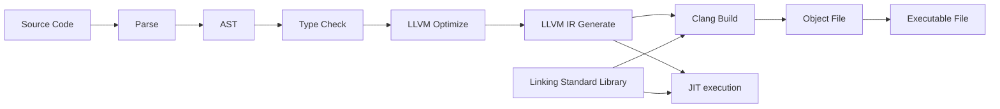

# Swua

The programming language that compiles to LLVM IR.



# Build and Usage

```bash
$ cargo build
$ swua --help

Usage: swua [OPTIONS] <COMMAND>

Commands:
  run    JIT compile and run Swua source code
  build  Compile Swua source code to native code
  help   Print this message or the help of the given subcommand(s)

Options:
  -o, --optimization-level <OPTIMIZATION_LEVEL>  Optimization level (0-3, default: 0)
      --output-dir <OUTPUT_DIR>                  Build output directory (default: ./build)
  -n, --name <NAME>                              Binary name (default: main)
      --no-verbose                               Don't print verbose information
  -h, --help                                     Print help
  -V, --version                                  Print version

$ swua -n hello build -i ./examples/hello_world.swua -l -a
Compiling ./examples/hello_world.swua (hello) [Unoptimized, Target: aarch64-apple-darwin]
Build Finished in 193 ms, output: ./build/hello

$ ./build/hello
Hello, World!
```

# Syntax

```
extern print_str(str) -> str
extern to_str(int) -> str
extern concat_str(str, str) -> str

define fib(n int) -> int =
    if n < 2
        return n
    else
        return fib(n - 1) + fib(n - 2)

define main -> int =
    print_str(concat_str("fib(10) = ", to_str(fib(10))))

    return 0
```

See [examples](./examples) for more details.

# Features and TODOs

-   LLVM Version: 16.0.0

-   [x] Frontend
    -   [x] Lexer
    -   [x] Parser
    -   [x] AST
    -   [x] Type Checker (Semantic Analysis)
    -   [ ] Macro
-   [x] Backend (WIP)
    -   [ ] Optimizer
    -   [x] LLVM IR Generator
-   [ ] Standard Library (WIP)
-   [ ] Documentation
-   [ ] More examples
-   [ ] More tests

... and more
