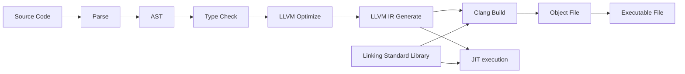

# Swua Programming Language

### Small, insignificant programming language using LLVM as backend. 😃

**English** | [한국어](./README.ko-KR.md) | [Examples](./examples) | [License](./LICENSE)

# Table of Contents

-   [Overview](#overview)
-   [Usage](#usage)
-   [Tutorial](#tutorial)
-   [Standard Library](#standard-library)
-   [Features and TODO](#features-and-todo)

# Overview

It's not ready yet. translating and reading [Korean documents](./README.ko-KR.md) is also a good option. 😉

# Usage

## Build from source

# Tutorial

# Standard Library

# Features and TODO
