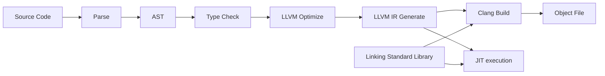

# Swua

The programming language that compiles to LLVM IR.



# Build and Usage

```bash
$ cargo build
$ swua --help

Usage: swua [OPTIONS] <COMMAND>

Commands:
  compile  Compile Swua source code
  run      JIT compile and run Swua source code
  help     Print this message or the help of the given subcommand(s)

Options:
  -l, --llvm-ir                                  Print LLVM IR
  -o, --optimization-level <OPTIMIZATION_LEVEL>  JIT Optimization level (0-3)
  -n, --name <NAME>                              LLVM Module name
      --no-verbose                               Don't print verbose information
  -h, --help                                     Print help
  -V, --version                                  Print version

$ swua compile -i ./examples/test.swua -o ./build/main.ll
$ clang ./build/main.ll -L ./build -l swua -o ./build/main
$ ./build/main
```

# Syntax

```rust
extern fn print_str(string) -> string;
extern fn concat_str(string, string) -> string;

fn main() -> int {
    print_str(concat_str("Hello, ", "World!"));
    return 0;
}
```

See [examples](./examples) for more details.

> **Note**
>
> Syntax may change in the future. it is currently based on the syntax of Rust and C-like languages.

# Features and TODOs

-   LLVM Version: 16.0.0

-   [x] Frontend `*`
    -   [x] Lexer
    -   [x] Parser
    -   [x] AST
    -   [x] Type Checker (Semantic Analysis)
-   [x] Backend `*`
    -   [ ] Optimizer
    -   [x] LLVM IR Generator
-   [ ] Standard Library
-   [ ] Documentation
-   [ ] More examples
-   [ ] More tests

`*`: WIP

... and more
